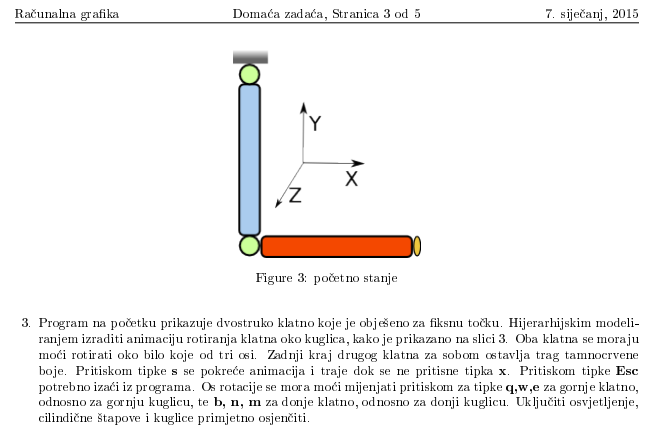

Readme in Croatian language:

Zadatak 3.

Slika iz zadatka je realizirana tako da gornji paralelepiped predstavlja objekt koji visi sa stropa (tj. paralelepiped nije strop).
To znaci da paralelepiped ogranicava prvi cilindar, ali drugi se moze naci iznad paralelepiped.

Koristenjem glPushMatrix i glPopMatrix te translacijama (glTranslatef) i rotacijama (glRotatef) realizira se hijerarhijsko modeliranje kojim se dobiva dvostruko njihalo sa slike.

Ovisno o osi rotacije i smjeru, pri svakom pozivu display funkcije kut rotacije se povecava ili smanjuje za 1.
Time se dobiva animacija.

Kretanje njihala je ograniceno primitivnim collision detectionom uz pomoc bounding sphere za donji cilindar te provjerom x koordinate za gornji cilindar.

Trag donjeg cilindra se dobiva tako da se sprema vektor matrica transformacije koje je donji cilindar prosao te se one iscrtavaju povezujuci vertexe u LINE_STRIP.

Upravljanje programom:
Program se pokrece bez argumenata. U pocetku ni za jedan cilindar nije zadana os rotacije.

s - start animacije
x - stop animacije
q, w, e - mijenajanje osi rotacije gornjeg cilindra
b, n, m - mijenajanje osi rotacije donjeg cilindra
Esc - izlaz

Reference:
Laboratorijske vjezbe
http://www.cplusplus.com/
https://developer.mozilla.org/en-US/docs/Games/Techniques/3D_collision_detection#Sphere_versus_sphere

The MIT License (MIT)

Copyright (c) 2015 Igor Pejic

Permission is hereby granted, free of charge, to any person obtaining a copy
of this software and associated documentation files (the "Software"), to deal
in the Software without restriction, including without limitation the rights
to use, copy, modify, merge, publish, distribute, sublicense, and/or sell
copies of the Software, and to permit persons to whom the Software is
furnished to do so, subject to the following conditions:

The above copyright notice and this permission notice shall be included in all
copies or substantial portions of the Software.

THE SOFTWARE IS PROVIDED "AS IS", WITHOUT WARRANTY OF ANY KIND, EXPRESS OR
IMPLIED, INCLUDING BUT NOT LIMITED TO THE WARRANTIES OF MERCHANTABILITY,
FITNESS FOR A PARTICULAR PURPOSE AND NONINFRINGEMENT. IN NO EVENT SHALL THE
AUTHORS OR COPYRIGHT HOLDERS BE LIABLE FOR ANY CLAIM, DAMAGES OR OTHER
LIABILITY, WHETHER IN AN ACTION OF CONTRACT, TORT OR OTHERWISE, ARISING FROM,
OUT OF OR IN CONNECTION WITH THE SOFTWARE OR THE USE OR OTHER DEALINGS IN THE
SOFTWARE.
